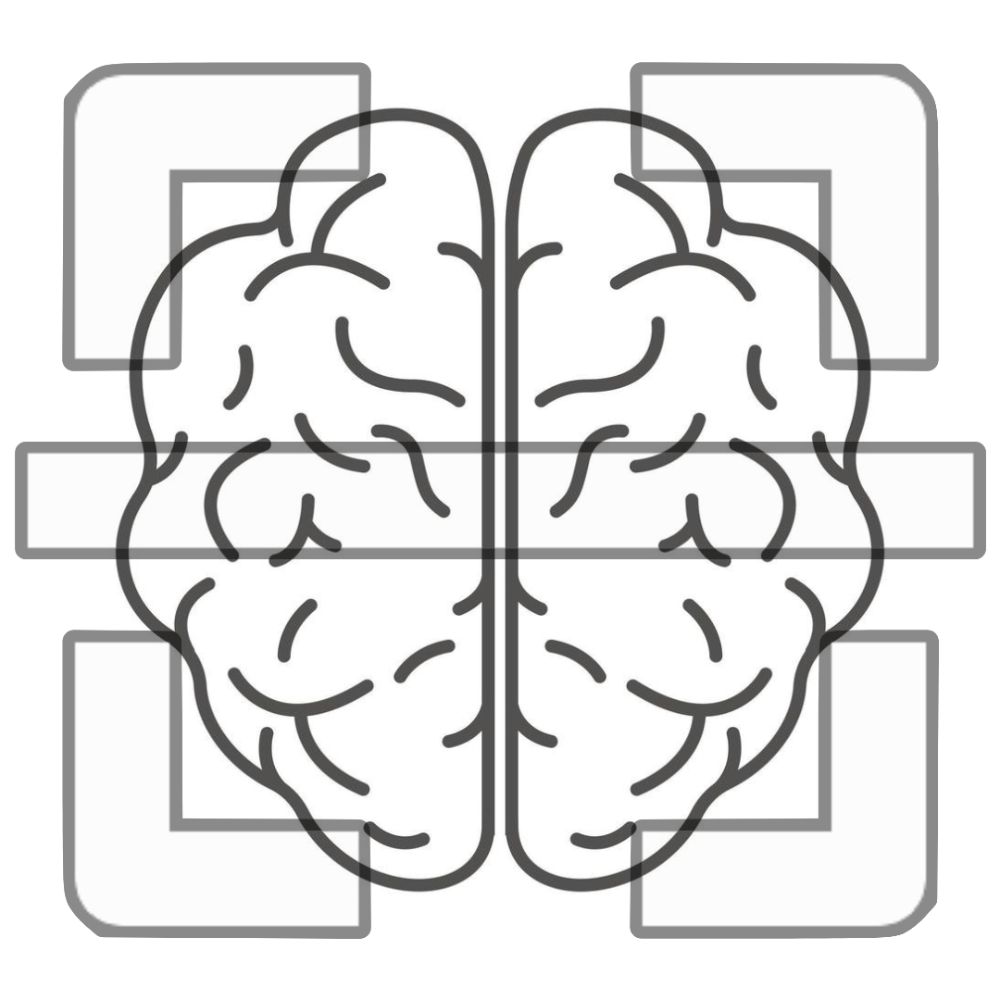

# TumoRanger

### MRI Scan Predictor 
TumoRanger is an Android application designed to assist doctors, particularly those with limited experience or access to advanced diagnostic tools, in diagnosing brain diseases using MRI images. By leveraging a cloud-based machine learning model, TumoRanger provides quick analysis, aiming to improve patient outcomes and support medical professionals in their crucial work. 

### Key Features
* <b> Cloud-Based Machine Learning Model: </b> Can be updated with the latest datasets to enhance diagnostic accuracy over time.
* <b> User-Friendly Interface: </b> Designed for ease of use, even for older doctors who may not be familiar with advanced technology.
* <b> Real-Time Feedback: </b> Provides rapid diagnostic insights, saving critical time in medical decision-making.
* <b> Localization Support: </b> Supports other language for better understanding.
### How It Works
* <b> Upload MRI Images:</b> Doctors can upload MRI scans through the app’s interface.
* <b> Cloud Analysis:</b> The images are processed by our cloud-based machine learning model.
* <b> Receive Results:</b> Diagnostic suggestions and insights are displayed on the app, helping doctors make informed decisions.
